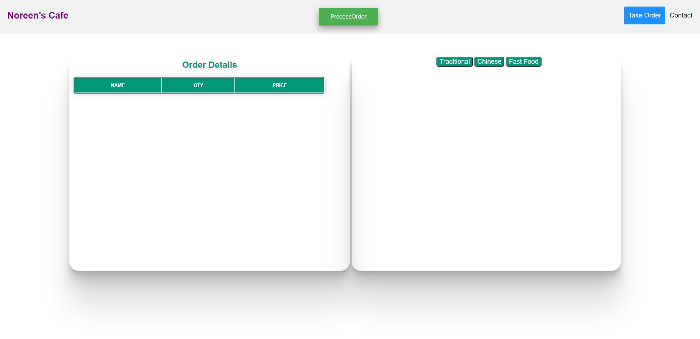
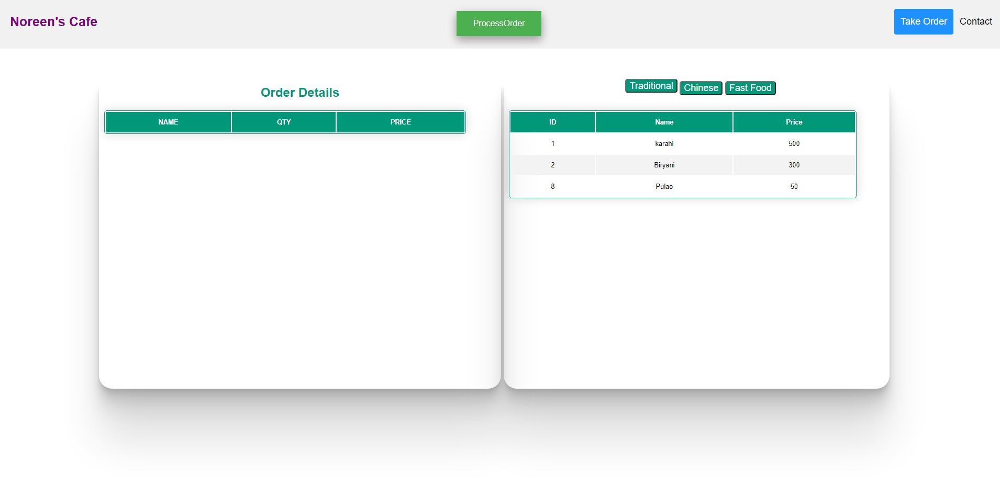
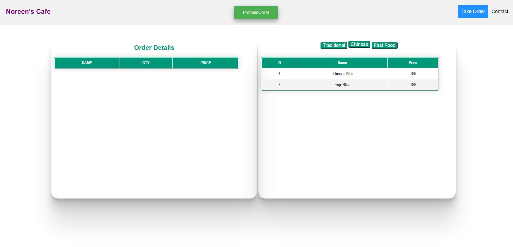
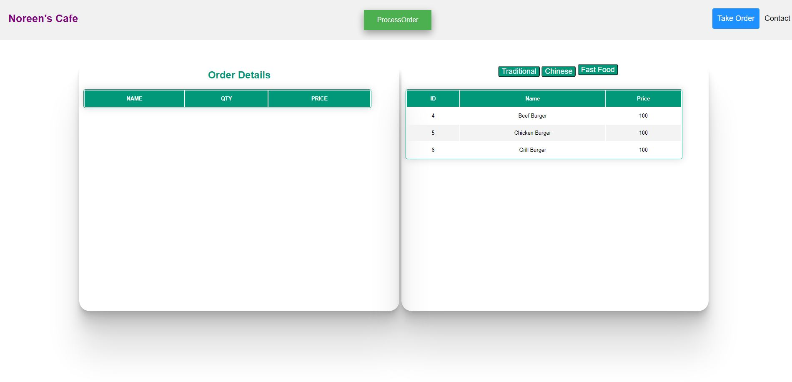
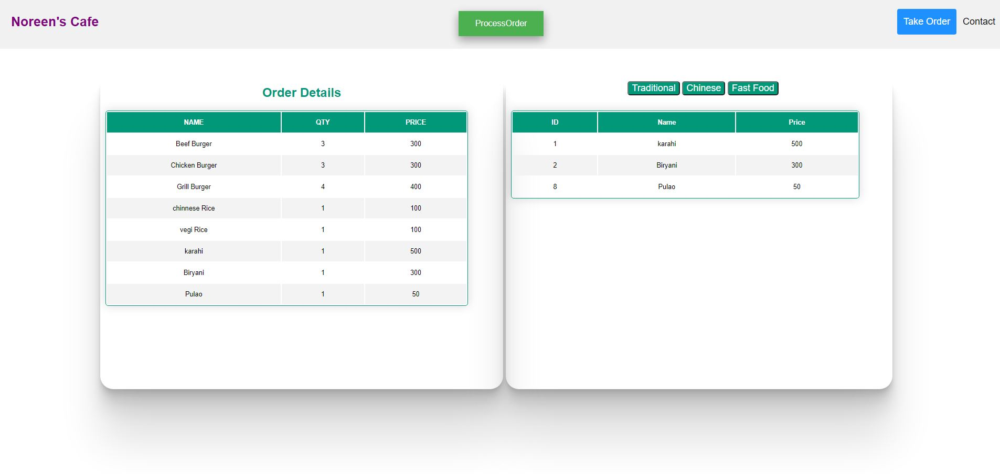
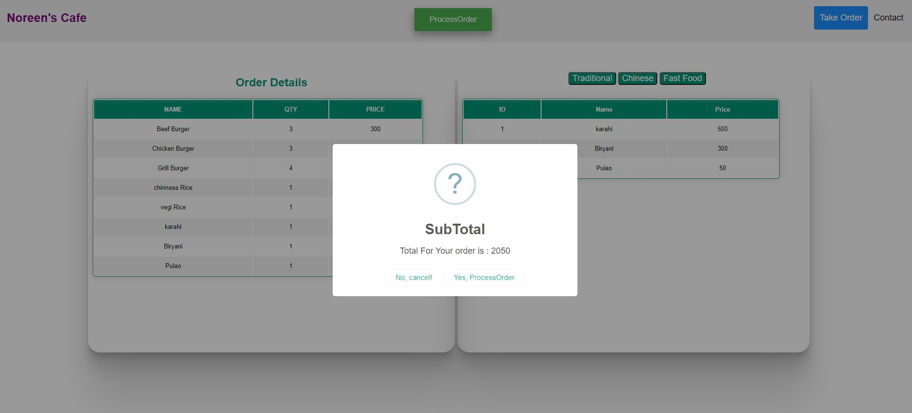
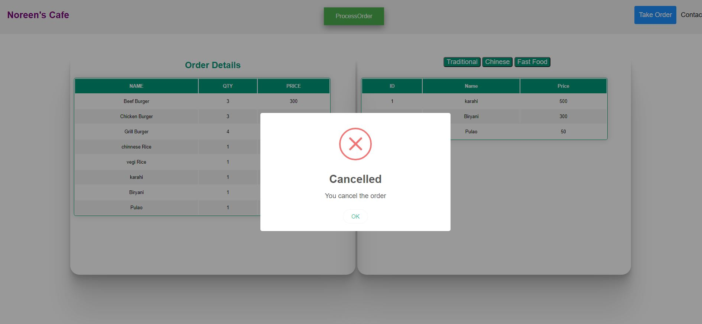
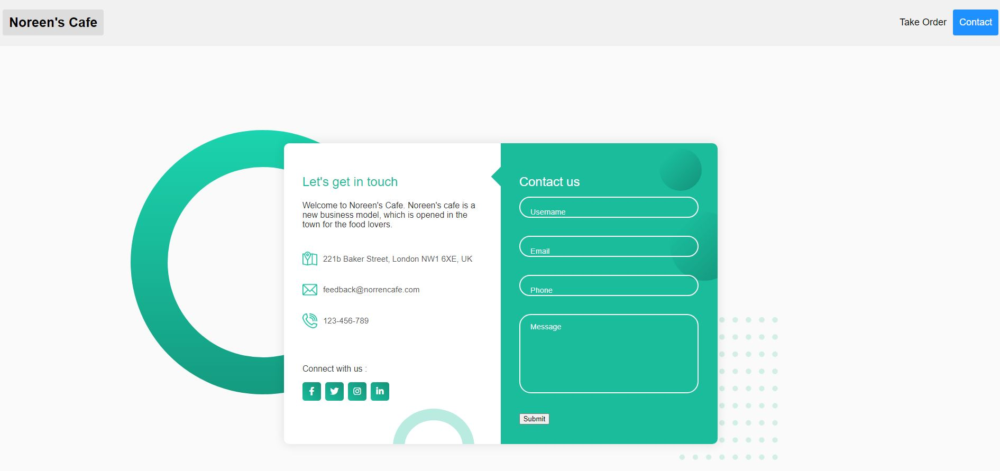

# Noreen-s-Cafe Order Management
## Introduction

The live link can be found here - (https://noreen-wb.github.io/norin-s-cafe/index.html)

Welcome to Noreen's Cafe. Noreen's cafe is a new business model, which is opened in the town for the food lovers. It's purpose is to give people Quality food and taste. We have the world's best chef in our Cafe. Who have traveled around the world and are very professional with their work. Noreen's cafe is very neat and clean and is very higenic place. We took care of our customer very well, before serving meal we disinfect all the  crokery so that there won't be any fungus or virus. Our head Chef is very intellegent and smart. He is responsible to maintain the enviroment of the kitchen and Dinein Happy and lively.

We have complete order management system. We have paper less enviroment. Waiter's in my cafe use tablets to take order. Reciept is generated when an order is placed. One reciept is goes to kitchen and one reciept is given to customer.

## Table of Contents 

# Table of Contents
 [1. User Expereince (UX) design](#ux)
  - [User Expectations:](#user-expectations)
  -	[Colour scheme and font](#color-scheme)
  - [Site skeleton (wireframes)-2 pages](#wireframes)
    - [Home page](#home-page)
    - [Contact page](#contact-page)

 [2. Features](#features)

 [3.Technologies used](#technologies-used)

 [4.Testing](#testing)

 [5.Bugs](#bugs)

 [6. Deployment](#deployment)

 [7. Acknowledgement](#acknowledgement)
 
 
# 1. User Expereince (UX) design
  [Go to top](#table-of-contents)
 
  The purpose of this is Order Management System. Which provides paper less system. waiter uses this website to take order from the customer. Waiter takes order from customer and then process the order. A reiept is generated of the order.
  
  
  
## 1.1 User Expectation 
  [Go to top](#table-of-contents)

  Menu is shown in different tabs. there are three buttons Traditional, chinese and fast food. When waiter clicks on Traditional button menu of traditional item is displayed. When waiter clicks on Chinese button menu of Chinese item is displayed. When waiter clicks on Fast Food button menu of Fast Food item is displayed. Folloiwng user's expections are considered while designing the site:
* The site structure is designed considering the expectation of users to be simple and easy to use.
* The user interface is easy to navigate (inlcude main navigation bar, drop dwon menu bar and a link at bottom of page that user can go back to top of the page in just one click).
* Responsive design for all screen/device sizes like mobile, tablet and desktop.
  
  
## 1.2 Color Scheme 
  [Go to top](#table-of-contents)
  The choice of website right foreground and background colour is essential that decides the site visitors wheather to emote the site or not. In this design we consider the accessibility guideline i.e, contrast between background and foreground colours.

Other foreground and background color used in the sites are
* foreground: #ffffff
* background: #044348

## 1.3 Site Skeleton
  [Go to the top](#table-of-contents)
 
[Balsamiq](https://balsamiq.com/) was used to create wireframes of the website. This was very useful as it gives the template of the UI. Wireframes were designed for web browser and a mobile browser format. The concept design (wireframes) of webpages (3 pages) prepared is presented below.

### Introduction Page

### Traditional

### Chinese

### FastFood

### OrderDetails

### ProcessOrder

### SubTotal

### cancel

### Mobile Order Details

### Mobile Contact

# 2. Features
  [Go to the top](#table-of-contents)
  
- Noreen's Cafe Hyper link is placed at the top left of each of the website. 
- Navigation bar is placed at top right of each page of the website.
- Sweetalert is used to create beautiful alerts.
- Social media links is placed at bottom of each page.
- All the dishes that are served in noreen's Cafe is displayed with its description and it's origin and price. 
- Dishes are categorised is three sections. Traditional, chinese and fast food for better understanding of the user.

### Home Page

- Noreen's Cafe hyper link is placed on top left corner of the page.
- Navigation bar is placed at on top right corner of the page.
- Process Button is placed in center of the page
- page conatins two section's one is showing order details. the order which is given by the user.
- second section show's menu list which are the item offered by our cafe.
- when waiter click on the process button, a popup appears with subtotal and options with cancel order and proceed order.
- when click on the process order, ther order is completed and a reciept is printed.
- when click on the cancel order, order is canceld.

Secreen shot of the Home page is below:

### Contact Page

- This page has same logo placement and navigation bar.
- Location of our cafe is displayed.
- Form is there to cantact to cafe's management.
- Social media links are also provided.

# 3. Technologies Used
  [Go to the top](#table-of-contents)

* [HTML5](https://en.wikipedia.org/wiki/HTML5) (markup language) was used for structuring and presenting content of the website.
 
* [CSS3](https://en.wikipedia.org/wiki/CSS) (Cascading Style Sheets) was used to provide the style to the content written in a HTML.
* [Balsamiq](https://balsamiq.com/) was used to create wireframes of the website (desktop and mobile version).
* [Font Awesome](https://fontawesome.com/) was used to improt icons to the sites.
* [Chrome](https://www.google.com/intl/en_uk/chrome/) was used to debug and test the source code using HTML5 as well as to test site responsiveness.
* [Github](https://github.com/) was used to create the repository and to store the cproject's code after pushed from Git.
* [Gitpod](https://www.gitpod.io/) was used as the Code Editor for the site

* [WebAim](https://webaim.org/resources/contrastchecker/) was used to select the background and font color in the website.
* [W3C Markup](https://validator.w3.org/) and [Jigsaw validation](https://jigsaw.w3.org/) tools were used to validate the HTML code and CSS style used in the proejct.
* [Ami](http://ami.responsivedesign.is/#) was used to develop a Mockup screenshot generator

  
# 4. Testing
  [Go to the top](#table-of-contents)
## 4.1 Testing using tools
### 4.1.1 Google Developer Tools
I make use of google developer tools (Chrome DevTools) as debugging tools. Using this tool i inspect for every elements that I added in HTML and CSS style. Once I was happy with, I copy the CSS style code from Chrome DevTools and paste in my CSS style sheet.

### 4.1.2 Responsive Tools

In order to make sure that design web pages are responsive to all device sizes, [Am I Responsive](http://ami.responsivedesign.is/) site was used to check it. 

### 4.1.3 W3C Validator Tools

[W3C Markup] (https://validator.w3.org/) was used to check for any errors within my HTML pages.
[W3C CSS Validation](https://jigsaw.w3.org/css-validator/) was used to check for any error within my CSS stylesheet. No errors were found.

## 4.2 Manual Testing

I have tested my site on multiple devices. These include:
  - Galaxy S5 (360 x 640)
  - iPhone 6/7/8 (375 x 667) 
  - iPhone 6/7/8 plus (414 x 736)
  - ipad (768 x 1024)
  - iPhone XS Max
  - iPad Pro (1024 x 1366)
  - Huawei P20 Pro
  
  
# 5. Bugs
  [Go to the top](#table-of-contents)

### Bugs

- The images directory is misspelled which is not showing images on live view.

### Solved Bugs

- I correct the spelling and images starts shwoing in live view.

   
# 6. Deployment
  [Go to the top](#table-of-contents)

The site was deployed to GitHub pages using the following steps:
- Sign up to GutHub
- Create a new repository on GitHub.
- Click on settings on the navigation bar under the repository title.
- Select pages on the left menu bar.
- Click on the master branch and save.
- This will now generate a link with your website live.
- The live link can be found here - (https://noreen-wb.github.io/norin-s-cafe/index.html)

# 7. Acknowledgement
  [Go to the top](#table-of-contents)
### Code
* The structure of the website came from the easy Tutorials.
* Naviagtion bar came from a youtube video https://www.youtube.com/watch?v=oYRda7UtuhA&t=3480s
* Coding for feedback.html page was inspired from differnt tutorial from https://codeinstitute.net/ 
* The icons in the footer and contact page came from [Font Awesome](https://fontawesome.com/)
* For README.md file, reference of https://github.com/Chris-McGonigle/emmas-beauty-parlour and https://github.com/iKelvvv/MS1 was considered. 
* Thanks to my mentor Marcel Mulders for his constructive feedback.

### Content
* All images came from unsplash https://unsplash.com/s/photos/food?orientation=landscape
* Description of the chefs was taken from varius google links.
* Famous Chef names and picture were taken from ther personal websites and google.

  
  
  