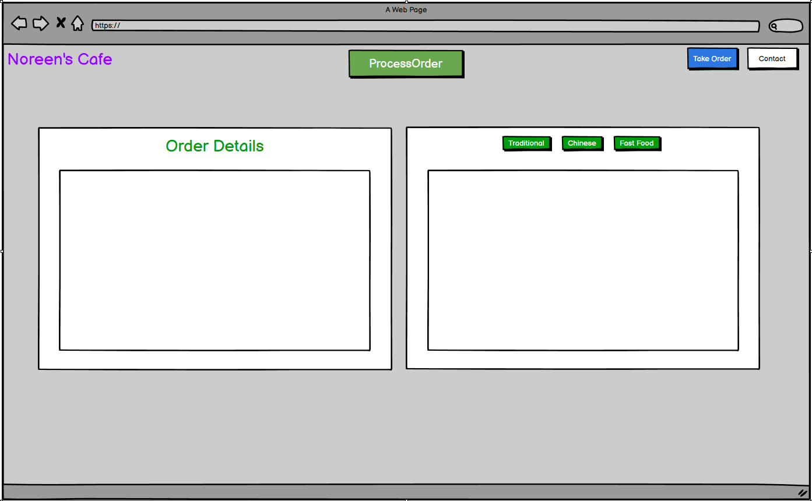
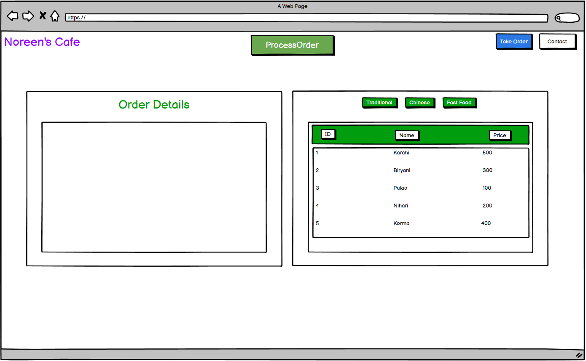
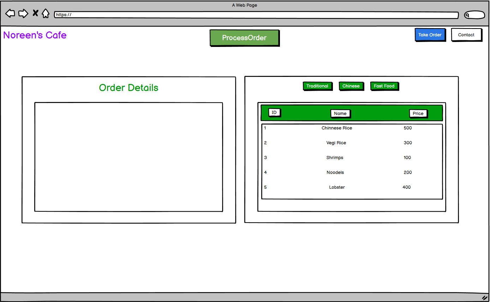
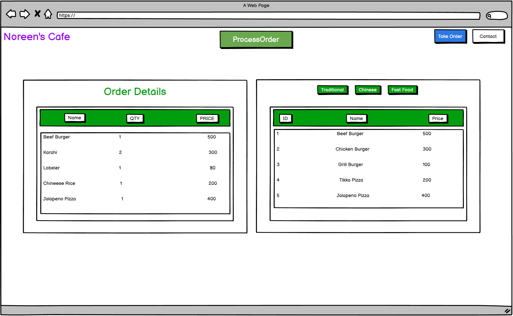
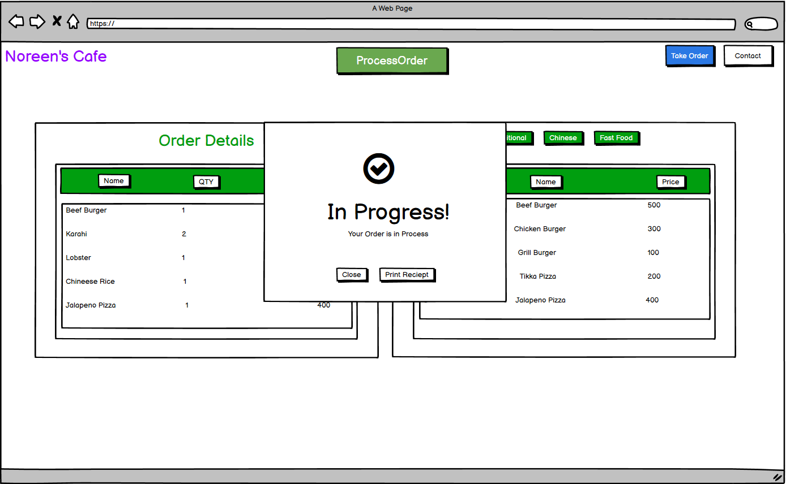
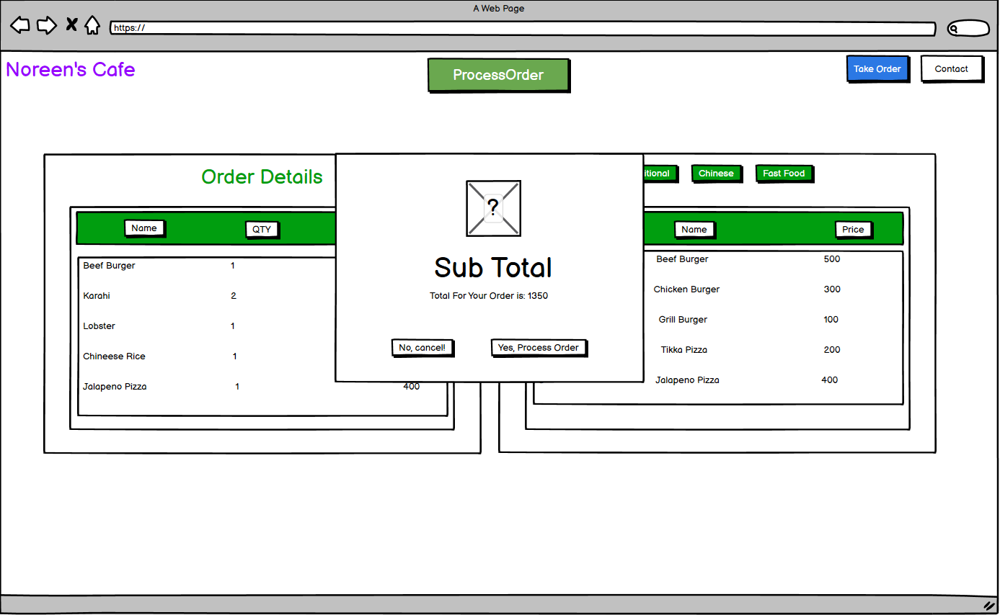
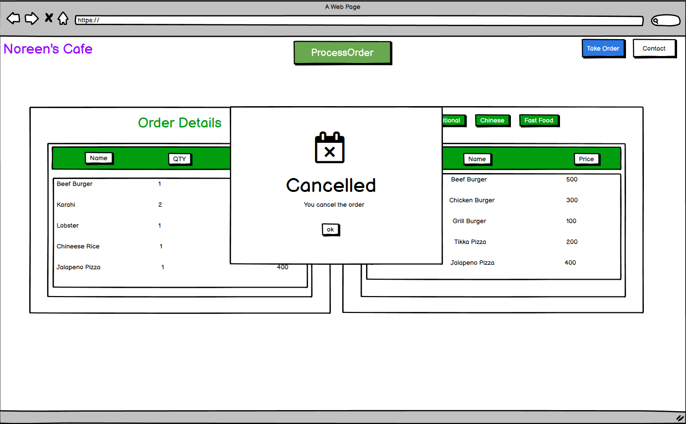
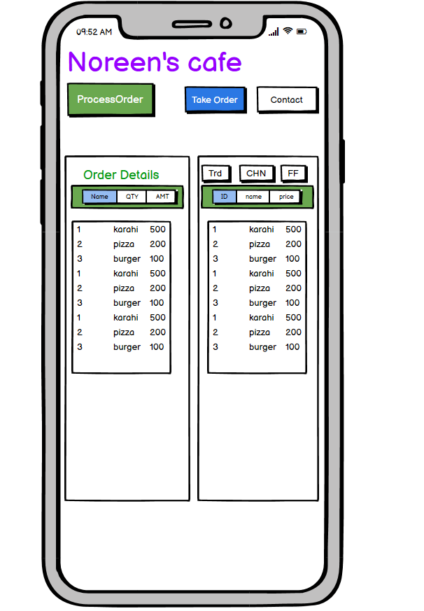
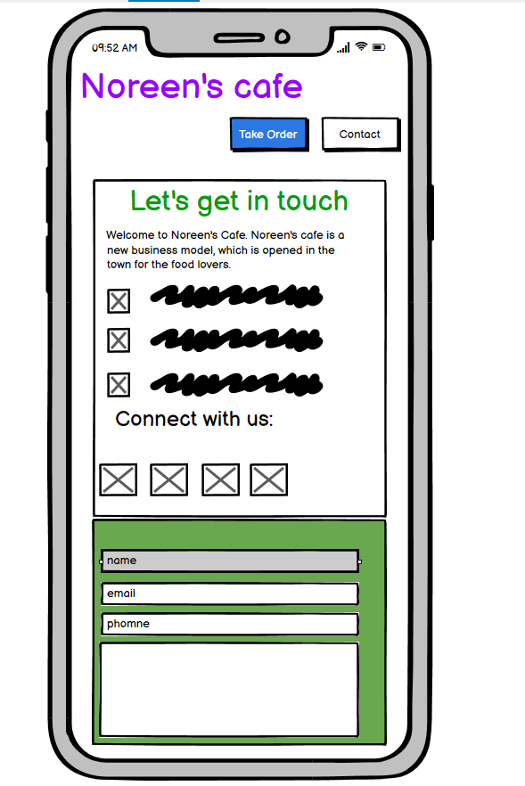

# Noreen-s-Cafe Order Management
## Introduction

The live link can be found here - (https://noreen-wb.github.io/norin-s-cafe/index.html)

Welcome to Noreen's Cafe. Noreen's cafe is a new business model, which is opened in the town for the food lovers. It's purpose is to give people Quality food and taste. We have the world's best chef in our Cafe. Who have traveled around the world and are very professional with their work. Noreen's cafe is very neat and clean and is very higenic place. We took care of our customer very well, before serving meal we disinfect all the  crokery so that there won't be any fungus or virus. Our head Chef is very intellegent and smart. He is responsible to maintain the enviroment of the kitchen and Dinein Happy and lively.

We have complete order management system. We have paper less enviroment. Waiter's in my cafe use tablets to take order. Reciept is generated when an order is placed. One reciept is goes to kitchen and one reciept is given to customer.

## Table of Contents 

# Table of Contents
 [1. User Expereince (UX) design](#ux)
  - [User Expectations:](#user-expectations)
  -	[Colour scheme and font](#color-scheme)
  - [Site skeleton (wireframes)-2 pages](#wireframes)
    - [Home page](#home-page)
    - [Contact page](#contact-page)

 [2. Features](#features)

 [3.Technologies used](#technologies-used)

 [4.Testing](#testing)

 [5.Bugs](#bugs)

 [6. Deployment](#deployment)

 [7. Acknowledgement](#acknowledgement)
 
 
# 1. User Expereince (UX) design
  [Go to top](#table-of-contents)
 
  The purpose of this is Order Management System. Which provides paper less system. waiter uses this website to take order from the customer. Waiter takes order from customer and then process the order. A reiept is generated of the order.
  
  
  
## 1.1 User Expectation 
  [Go to top](#table-of-contents)

  Menu is shown in different tabs. there are three buttons Traditional, chinese and fast food. When waiter clicks on Traditional button menu of traditional item is displayed. When waiter clicks on Chinese button menu of Chinese item is displayed. When waiter clicks on Fast Food button menu of Fast Food item is displayed. Folloiwng user's expections are considered while designing the site:
* The site structure is designed considering the expectation of users to be simple and easy to use.
* The user interface is easy to navigate (inlcude main navigation bar, drop dwon menu bar and a link at bottom of page that user can go back to top of the page in just one click).
* Responsive design for all screen/device sizes like mobile, tablet and desktop.
  
  
## 1.2 Color Scheme 
  [Go to top](#table-of-contents)
  The choice of website right foreground and background colour is essential that decides the site visitors wheather to emote the site or not. In this design we consider the accessibility guideline i.e, contrast between background and foreground colours.

Other foreground and background color used in the sites are
* foreground: #ffffff
* background: #044348

## 1.3 Site Skeleton
  [Go to the top](#table-of-contents)
 
[Balsamiq](https://balsamiq.com/) was used to create wireframes of the website. This was very useful as it gives the template of the UI. Wireframes were designed for web browser and a mobile browser format. The concept design (wireframes) of webpages (3 pages) prepared is presented below.

### Introduction Page

### Traditional

### Chinese

### FastFood

### OrderDetails

### ProcessOrder

### SubTotal

### cancel

### Mobile Order Details

### Mobile Contact

  
  
  